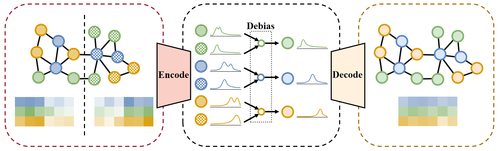

# ANT
Implementation of the paper "Adaptable Node Alignment for Relieving Distribution Shift on Graphs"



**Step 1**
Generate a dataset with feature shifts:

```bash
python make_dataset.py cora
python make_dataset.py photo
```

**Step 2**
